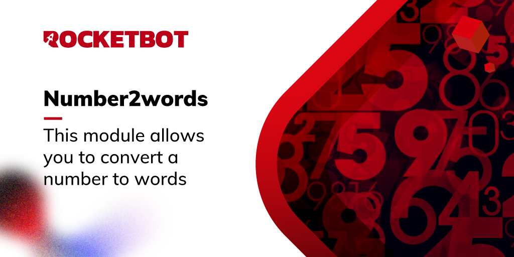

# number2words
  
This module allows you to convert a number to words.  

*Read this in other languages: [English](Manual_number2words.md), [Português](Manual_number2words.pr.md), [Español](Manual_number2words.es.md)*
  

## How to install this module
  
To install the module in Rocketbot Studio, it can be done in two ways:
1. Manual: __Download__ the .zip file and unzip it in the modules folder. The folder name must be the same as the module and inside it must have the following files and folders: \__init__.py, package.json, docs, example and libs. If you have the application open, refresh your browser to be able to use the new module.
2. Automatic: When entering Rocketbot Studio on the right margin you will find the **Addons** section, select **Install Mods**, search for the desired module and press install.  

## Description of the commands

### Number to words
  
This command allows you to convert a number to words.
|Parameters|Description|example|
| --- | --- | --- |
|Number to be converted|Number to be converted to words|1000|
|Output language|Language that the converted number will have|English|
|Result|Variable where the result will be saved|result|
