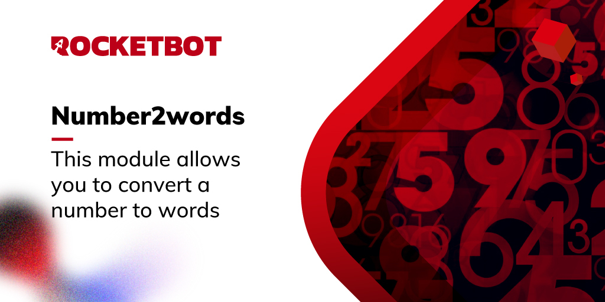

# number2words
  
Este módulo permite converter um número em palavras.  

*Read this in other languages: [English](Manual_number2words.md), [Português](Manual_number2words.pr.md), [Español](Manual_number2words.es.md)*
  

## Como instalar este módulo
  
Para instalar o módulo no Rocketbot Studio, pode ser feito de duas formas:
1. Manual: __Baixe__ o arquivo .zip e descompacte-o na pasta módulos. O nome da pasta deve ser o mesmo do módulo e dentro dela devem ter os seguintes arquivos e pastas: \__init__.py, package.json, docs, example e libs. Se você tiver o aplicativo aberto, atualize seu navegador para poder usar o novo módulo.
2. Automático: Ao entrar no Rocketbot Studio na margem direita você encontrará a seção **Addons**, selecione **Install Mods**, procure o módulo desejado e aperte instalar.  

## Descrição do comando

### Número para palavras
  
Este comando permite converter um número em palavras.
|Parâmetros|Descrição|exemplo|
| --- | --- | --- |
|Número para converter|Número para converter em palavras|1000|
|Idioma de saida|Idioma que o número convertido terá|Portuguese|
|Resultado|Variável onde o resultado será salvo|result|
